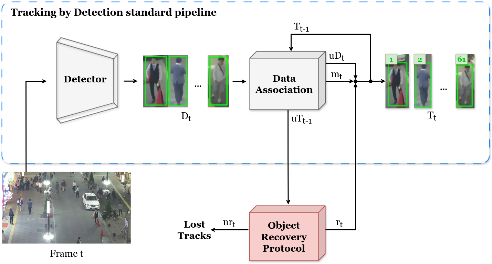

<div align="center">

# SGAR-MOT
**Segmentation-Guided Association Refinement in Multiple Object Tracking**

[Manuel Bendaña](mailto:manuel.bendana.gomez@usc.es) &nbsp;·&nbsp; [Victor M. Brea](mailto:victor.brea@usc.es) &nbsp;·&nbsp; [Manuel Mucientes](mailto:manuel.mucientes@usc.es)

*Centro Singular de Investigación en Tecnoloxías Intelixentes (CiTIUS), Universidade de Santiago de Compostela*

[](https://doi.org/10.1016/j.neucom.2026.135176)
[](./LICENSE)

**[Read the paper](https://www.sciencedirect.com/science/article/pii/S0925231226025749)** · *Neurocomputing* (2026)

</div>

---

## Overview

Tracking-by-Detection (TbD) is the dominant paradigm in Multiple Object Tracking (MOT), but it inherits the failures of its detector: when an object is missed —typically under occlusion— the associated track is considered *lost*. As a result, the trajectory fragments, and the object often reappears later under a new identity.

**SGAR-MOT** handles detector failures directly. Instead of discarding a track the moment the association step leaves it unmatched, SGAR-MOT tries to determine if *the object is still there*. For doing so, it uses **segmentation masks** rather than bounding boxes, as overlapping boxes can mix pixels from several instances, whereas masks isolate the target and keep distinctive shape cues robust to partial occlusions.

The answer to that question is produced by our **Object Recovery Protocol (ORP)**, a module that couples a video segmentation model (SAM 2) with a novel learned identity-verification network (MIR). Tracking still runs —and still outputs— bounding boxes, using segmentation masks internally for object recovery.

<div align="center">

<p><em>SGAR-MOT architecture: the conventional TbD pipeline (blue) and the Object Recovery Protocol (red).</em></p>
</div>

## Main contributions

* **Object Recovery Protocol (ORP).** A novel module that manages tracks typically considered as lost in the standard TbD pipeline due to detector failures. It leverages segmentation masks and integrates a video segmentation method alongside a novel ViT-based network, the Mask Instance Resolver (MIR), which verifies identity through a learned spatiotemporal representation over multiple mask embeddings —and not through geometric thresholds or handcrafted similarity metrics.

* **SGAR-MOT tracker.** A new tracking framework that integrates the ORP module into a conventional bounding box-based TbD architecture. It couples box-level detection with mask-level identity reasoning, improving the robustness under occlusion scenarios.

* **Empirical validation.** SGAR-MOT outperforms its baseline tracker (ByteTrack) and achieves competitive results across multiple datasets (MOT20, SportsMOT and VisDrone), obtaining the **best average ranking** among all evaluated methods. ORP also transfers: attached to SORT with the *same, unretrained* MIR weights, it still improves MOTA and HOTA on all three datasets, confirming the effectiveness of masks in improving tracking performance under challenging conditions.

## Results

### Against the baseline (ByteTrack, same YOLOX detector)

*Errors = FP + FN. Test sets in all three cases.*

| Dataset | Method | MOTA ↑ | HOTA ↑ | IDF1 ↑ | FP ↓ | FN ↓ | Errors ↓ | IDSW ↓ |
|---|---|---|---|---|---|---|---|---|
| **MOT20** | ByteTrack | 74.0 | **59.2** | **72.6** | 16,749 | 116,927 | 133,676 | **1,069** |
| | **SGAR-MOT** | **74.4** | 59.0 | 72.1 | 23,085 | **108,483** | **131,568** | 1,090 |
| | *Difference* | *+0.4* | *−0.2* | *−0.5* | *+6,336* | *−8,444* | ***−2,108*** | *+21* |
| **SportsMOT** | ByteTrack | 93.9 | 62.6 | 69.6 | **28,780** | 30,160 | 58,940 | 3,525 |
| | **SGAR-MOT** | **94.1** | **63.4** | **70.7** | 30,885 | **26,016** | **56,901** | **3,265** |
| | *Difference* | *+0.2* | *+0.8* | *+1.1* | *+2,105* | *−4,144* | ***−2,039*** | *−260* |
| **VisDrone** | ByteTrack | 31.2 | 34.2 | 40.2 | **12,061** | 198,533 | 210,594 | **1,260** |
| | **SGAR-MOT** | **31.4** | **34.4** | **40.5** | 12,613 | **197,458** | **210,071** | 1,265 |
| | *Difference* | *+0.2* | *+0.2* | *+0.3* | *+552* | *−1,075* | ***−523*** | *+5* |

ORP converts false negatives into recovered tracks on every dataset. Although it introduces some false positives, the net error count always drops. On SportsMOT, the gain is largest in identity-aware metrics (HOTA and IDF1), driven by 260 fewer identity switches. MOT20 is the hardest case —huge density: 123.2 objects per frame on average—, where SAM 2 more often propagates a mask onto a neighbouring instance; HOTA and IDF1 dip slightly there, though total errors still fall.

### Average ranking across the three benchmarks

SGAR-MOT ranks first only on VisDrone, but it is the **only method in the top three everywhere**, which gives it the best global average. Pairwise Wilcoxon signed-rank tests on per-sequence MOTA against ByteTrack and HybridSORT —the second- and third-best methods by average ranking— reject the null hypothesis at `p < 0.05`.

| Method | MOT20 | SportsMOT | VisDrone | **Average** |
|---|:---:|:---:|:---:|:---:|
| **SGAR-MOT (ours)** | 3 | 3 | 1 | **2.33** |
| ByteTrack (ECCV 2022) | 4 | 4 | 2 | 3.33 |
| HybridSORT (AAAI 2024) | 1 | 2 | 9 | 4.00 |
| SORT + ORP | 5 | 5 | 6 | 5.33 |
| QDTrack (TPAMI 2023) | 2 | 9 | 5 | 5.33 |
| OC-SORT (CVPR 2023) | 7 | 1 | 8 | 5.33 |
| SORT (ICIP 2016) | 6 | 6 | 7 | 6.33 |
| MOTIP (CVPR 2025) | 9 | 7 | 3 | 6.33 |
| SambaMOTR (ICLR 2025) | 8 | 8 | 4 | 6.67 |

## Installation and usage

**[docs/TUTORIAL.md](./docs/TUTORIAL.md)** covers everything: installation (a Dockerfile is provided), the expected data layout, the commands for MOT20, SportsMOT and VisDrone, and even how to train MIR, although models are also provided.

## Citation

If you find this work useful, please star the project and consider citing us as:

```bibtex
@article{Bendana2026SGARMOT,
  title   = {Segmentation-guided association refinement in multiple object tracking},
  author  = {Benda{\~n}a, Manuel and 
             Brea, Victor M. and
             Mucientes, Manuel},
  journal = {Neurocomputing},
  pages   = {135176},
  year    = {2026},
  issn    = {0925-2312},
  doi     = {10.1016/j.neucom.2026.135176}
}
```

## Acknowledgements

SGAR-MOT builds on [ByteTrack](https://github.com/ifzhang/ByteTrack),
[YOLOX](https://github.com/Megvii-BaseDetection/YOLOX) and
[SAM 2](https://github.com/facebookresearch/sam2) — our thanks to their authors.

<details>
<summary>Funding</summary>
This work has received financial support from the Agencia Estatal de Investigación (Spain) (grant numbers PID2023-149549NB-I00 and PID2024-155219OB-C32), the "Cátedra Televés en Diseño Microelectrónico" by the PERTE Chip (grant number TSI-069100-2023-0010), the Galician Ministry for Education, Universities and Professional Training and the "ERDF A way of making Europe" through grants "Galician Research Centre Accreditation 2024-2027 ED431G-2023/04" and "Reference Competitive Group Accreditation 2026-2029 ED431C 2026/52". Manuel Bendaña is supported by the Spanish Ministerio de Universidades under the FPU national plan (grant number FPU22/01828).
</details>

## License

The code written for SGAR-MOT is released under the [PolyForm Noncommercial License 1.0.0](./LICENSE): free to use, modify and redistribute for any noncommercial purpose, which explicitly includes research, teaching and use by public research organizations. For commercial use, contact the authors.

Third-party code redistributed here keeps its own licence — SAM 2 (Apache 2.0), ByteTrack (MIT), YOLOX (Apache 2.0) — see [THIRD_PARTY.md](./THIRD_PARTY.md).