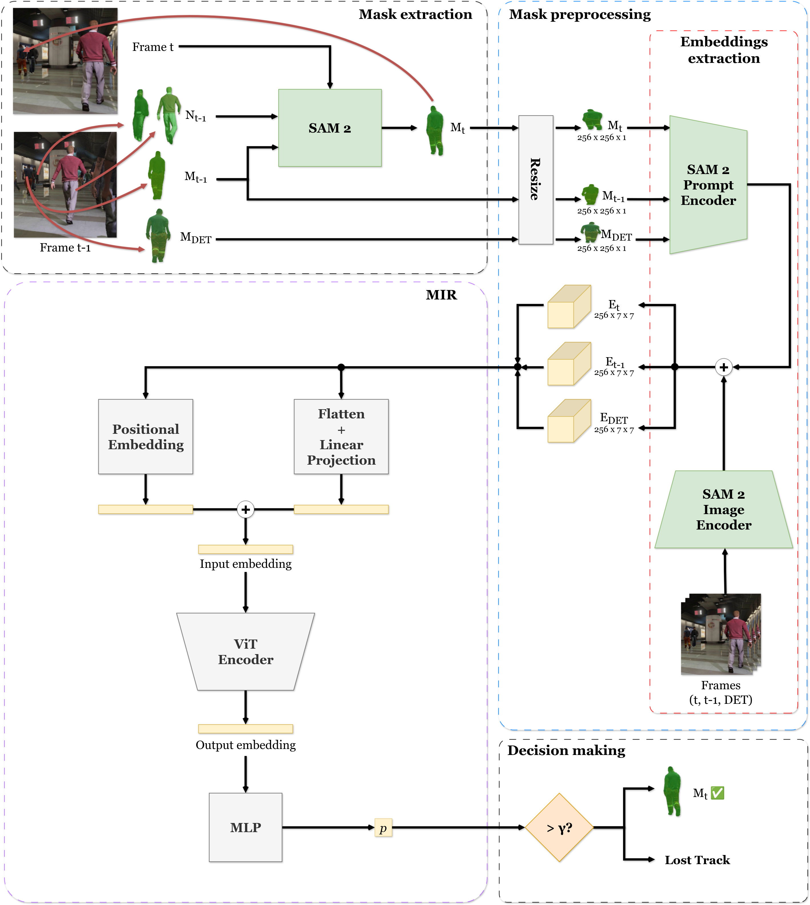

# SGAR-MOT
Segmentation-Guided Association Refinement in Multiple Object Tracking

> **NOTE**: Code and more information about the project will be available when article is accepted.

## Abstract

Multiple Object Tracking (MOT) aims to detect all objects in a video sequence and maintain consistent identities across frames. While Tracking-by-Detection (TbD) remains the dominant paradigm due to its effectiveness, its reliance on object detectors makes it vulnerable to failures, particularly in occlusion scenarios. These failures often result in fragmented trajectories and degraded tracking performance. In this work, we propose SGAR-MOT ---which stands for Segmentation-Guided Association Refinement in Multiple Object Tracking---, a novel framework that enhances TbD pipelines by recovering object tracks lost due to detection errors. SGAR-MOT introduces the Object Recovery Protocol (ORP), which leverages segmentation masks and integrates a video segmentation method with a Vision Transformer-based module, the Mask Instance Resolver (MIR), to assess track continuity. SGAR-MOT incorporates mask-level evidence and a learned identity-consistency verification step through MIR to determine whether a lost track should be reinstated. Experimental results across multiple benchmarks, including MOT20, SportsMOT and VisDrone, demonstrate that SGAR-MOT consistently outperforms its baseline tracker and achieves competitive results against state-of-the-art methods. These improvements highlight the effectiveness of integrating segmentation-guided reasoning into a conventional TbD pipeline, providing a hybrid tracking paradigm that is more robust to detector failures.

## Main contributions

* **Object Recovery Protocol (ORP)**: novel module that manages tracks typically considered as lost in the standard TbD pipeline due to detector failures. It leverages segmentation masks and integrates a video segmentation method alongside a novel ViT-based network, the Mask Instance Resolver (MIR), which determines whether a track can successfully recovered or should be definitively discarded.

* **SGAR-MOT tracker**: new tracking framework that integrates ORP module into a conventional bounding box-based TbD architecture. This enables the recovery of tracks that would otherwise be lost in each frame due to detector failures, enhancing robustness in occlusion scenarios through the use of segmentation masks.

* **Empirical validation**: we demonstrate that SGAR-MOT outperforms its baseline tracker and achieves competitive results across multiple dataset, including widely used MOT benchmarks such as MOT20, as well as more challenging scenarios like SportsMOT and VisDrone. Notably, SGAR-MOT achieves the highest average performance among all evaluated methods, confirming the efectiveness of masks in improvin tracking performance under challenging conditions.

## ORP overview

1. **Mask Extraction**: it is based on the use of SAM 2 for obtaining visual information of each object. For that, it leverages information of its previous state and its neighborhood. Three masks are extracted for the object in three key moments:

    * $M_t$: current frame.
    * $M_{t-1}$: previous frame.
    * $M_{DET}$: detection frame, which represents a previous frame in which the detection was reliable.

2. **Mask Preprocessing**: it takes the masks extracted by SAM 2 and converts them onto rich numeric embedding representations that combine form, context and temporal coherence.

3. **Mask Instance Resolver (MIR)**: a Vision-Transformer (ViT)-based network that learns identity consistency. It identifies if all three masks belong to the same object and, therefore, if it can be maintained in a frame in which there was a detection failure.